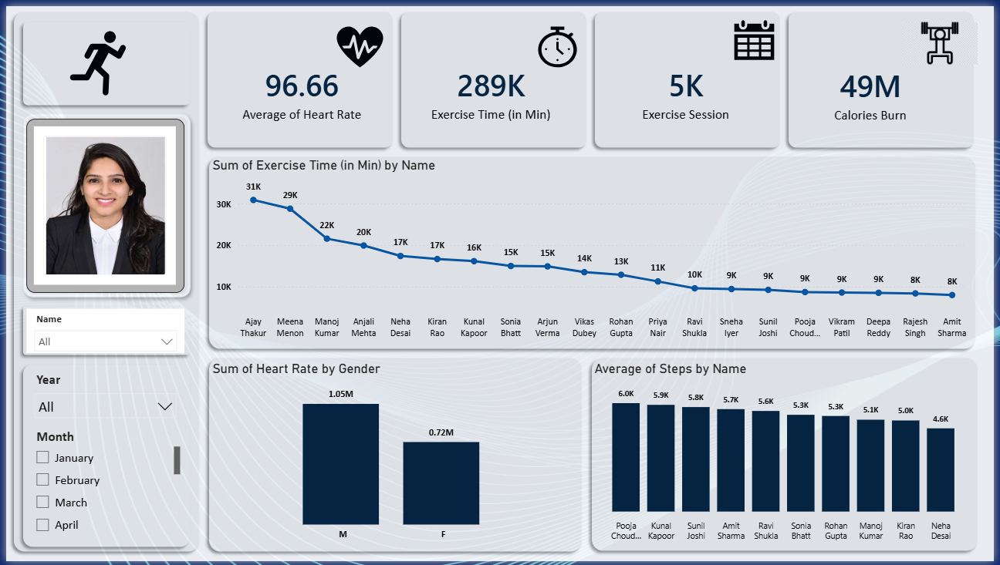

# 🏃 Fitness Analytics Dashboard

## Project Overview

This project presents an interactive Fitness Analytics Dashboard built in Microsoft Power BI using data from Microsoft Excel. The dashboard analyzes exercise activity, heart rate, exercise sessions, calories burned, and steps through interactive visualizations, filters, and image tooltips.

## Tools Used

- Microsoft Power BI
- Microsoft Excel
- Microsoft Power Query
- DAX
- Microsoft PowerPoint

## Dashboard Features

- KPI cards for Average Heart Rate, Exercise Time, Exercise Sessions, and Calories Burned
- Exercise Time by Person
- Heart Rate Analysis by Gender
- Average Steps by Person
- Interactive filters for Name, Year, and Month
- Interactive image tooltips for person-level details
- Custom dashboard background designed in Microsoft PowerPoint and imported into Power BI as an SVG

## Business Insights

- The dashboard provides an overview of fitness activity and performance across individuals.
- Exercise time varies across individuals, highlighting differences in activity levels.
- Heart rate can be compared across genders to understand overall activity patterns.
- Step counts show differences in activity levels among individuals.
- Interactive filters and image tooltips allow users to explore individual-level insights.

## Skills Demonstrated

- Power BI Dashboard Creation
- Data Cleaning
- Data Transformation
- DAX
- Data Visualization
- Interactive Reports
- Image Tooltips
- Excel Data Analysis
- Custom Dashboard Background Design
- Business Insights

## Project Preview

## Interactive Tooltip Preview

## Author

**Prachi Vaishkiyar**

📊 Aspiring Data Analyst | Excel | Power Query | Power BI | SQL| Currently Learning Data Analytics
